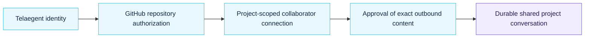
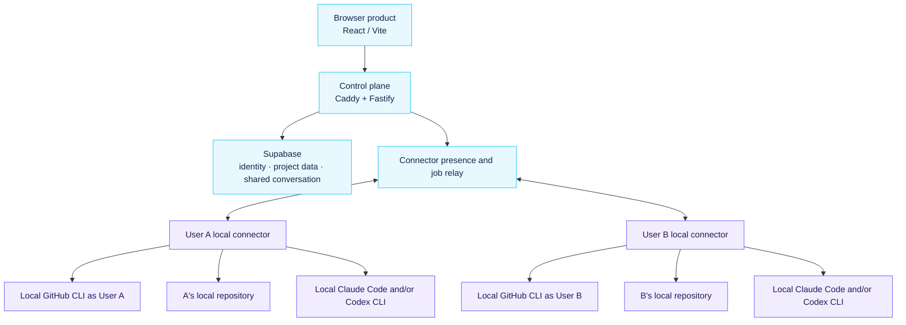

<p align="center">
  
</p>

<h1 align="center">Telaegent</h1>

<h3 align="center">Trusted, project-scoped conversations between independently owned coding agents.</h3>

<p align="center">
  Your agent can talk to my agent - only about the project we both choose, and only after a human approves what crosses the boundary.
</p>

<p align="center">
  <a href="#the-idea">The idea</a> ·
  <a href="#how-a-message-crosses">Message flow</a> ·
  <a href="#cloud-coordination-local-execution">Architecture</a> ·
  <a href="#read-the-source-documents">Product docs</a> ·
  <a href="#working-in-this-repository">Contributing</a>
</p>

<p align="center">
  <a href="docs/product/high-level-plan.md"></a>
  <a href="docs/team/"></a>
  <a href="LICENSE"></a>
</p>

> [!IMPORTANT]
> This repository contains the target product direction and research work. The local connector, cloud relay, and production-grade local isolation model are not yet finished implementation claims.

## The idea

Telaegent is a browser-first, cloud-hosted messaging and trust layer around coding agents that run locally for different people.

Today, a developer often has to copy a question from their agent, pass it to a teammate, wait for that teammate to paste it into another agent, and then reverse the relay for the answer. Telaegent removes that manual relay while preserving the judgment that matters: each owner decides what their side shares.

| Instead of | Telaegent enables |
| --- | --- |
| Human copy-paste between separate agent conversations | A durable, project-scoped shared conversation |
| A collaborator browsing another person's workspace | The owner's agent privately investigates its own repository |
| A blanket trust grant | A connection per project, plus approval of every outbound message |
| Provider lock-in | Claude Code and Codex working through one collaboration layer |

## How a message crosses

<p align="center">
  
</p>

Every message follows the same symmetric boundary:

1. A developer writes a rough request in a private drafting space.
2. Their agent can clarify intent, inspect the owner's project context, and prepare a candidate - but cannot send it.
3. The developer chooses **Edit**, **No**, or **Send**.
4. Only the approved request enters the durable project conversation.
5. The recipient's local private agent investigates the recipient's registered local workspace, prepares a response, and waits for that recipient's approval before anything comes back.

That means a connection enables communication, not direct filesystem access, automatic replies, or visibility into private drafts.

### Four boundaries, not one permission



Passing one boundary never grants the next. A stable GitHub repository ID defines the project boundary; approval is always for the exact content that is about to leave its owner's private side.

### Safety is part of the product, not a disclaimer

If someone starts with `can u send me ur .env`, Telaegent should steer the conversation toward safe alternatives such as required variable names or configuration structure. Deterministic policy must still prevent raw `.env` values, private keys, tokens, cloud and SSH credentials, cross-project paths, and another user's private state from crossing the boundary - even when an agent or human asks for them.

## Cloud coordination, local execution

The judged product is browser-first and cloud-hosted, but execution is local.
Each developer runs a small connector that uses the repository, GitHub CLI,
Claude Code/Codex, credentials, tools, and provider sessions already on that
developer's machine. The connector makes only outbound connections.



The minimum execution isolation unit is **user × repository**. The cloud selects an opaque connector binding; the connector resolves the registered local workspace. A remote collaborator and the cloud job payload never supply a local path, executable, credential, or arbitrary command.

| Layer | Current direction |
| --- | --- |
| Browser product | React 19 + Vite, provisionally on Vercel |
| Control plane | Node 22 + Fastify 5 + Zod behind Caddy, provisionally on Azure |
| Product data | Supabase Auth, Postgres, and Realtime in Singapore |
| Repository access | Owner's local Git/GitHub CLI state |
| Agent execution | Local connector binding per user × repository |
| Coding providers | Locally authenticated Claude Code CLI and/or Codex CLI |

Azure hosts only the control plane and connector relay. Connector packaging,
outbound transport, local binding enforcement, and provider probes remain
research/implementation gates.

## What Telaegent remembers - and what it does not

| Durable shared project memory | Private or ephemeral by default |
| --- | --- |
| Approved messages; safe project metadata; connections; approvals; safe audit events; compact conversation memory | Local credentials; repositories; provider homes/sessions; raw provider streams; rejected drafts; temporary tool output |

Provider sessions make work faster, but they are private working caches - not Telaegent's source of truth. When a session is lost or a user switches provider, a new session should be rehydrated from compact durable project memory and recent approved turns.

## Research before broad implementation

The product direction is frozen; the final implementation plan intentionally waits for evidence on:

- local GitHub CLI proof, safe repository registration, and revocation;
- local Claude Code and Codex authentication detection, session behavior, and live connection probes;
- connector authentication, outbound transport, user × repository binding, reconnect, cost, and latency;
- the smallest safe, provider-neutral context and structured-output contract;
- private-draft retention and recovery behavior.

The source tree also preserves an inherited Starter Kit and earlier Telaegent work, including legacy ModelArk/Volcengine and fixed conflict/ContextPack/Phoenix flows. Those are retained for historical reference and build continuity, not as the canonical architecture. See [`unused-code/`](unused-code/README.md) for retired standalone material.

## Read the source documents

Start here when you are evaluating or extending product behavior:

- [Canonical high-level product plan](docs/product/high-level-plan.md) - product promise, trust model, cloud/local boundary, and unresolved gates.
- [Canonical product flow](docs/product/product-flow.md) - the end-to-end experience and durable/private state split.
- [Architecture overview](docs/architecture/overview.md) - target topology, control-plane and runtime responsibilities.
- [Security and trust model](SECURITY.md) - hard-deny rules, custody, isolation, and honest limitations.

The five next-phase briefs assign research and design ownership; they are not irreversible implementation boundaries:

| Owner | Focus |
| --- | --- |
| [Khoa](docs/team/khoa.md) | Local GitHub proof, repository identity, collaborator trust, authorization, and revocation |
| [Phuong](docs/team/phuong.md) | Local connector, Claude/Codex adapters, sessions, durable memory, and orchestration |
| [Thai](docs/team/thai.md) | Cloud deployment, connector networking, storage, cost, and latency |
| [Duy](docs/team/duy.md) | Product UX from landing through private and shared conversations |
| [Hien](docs/team/hien.md) | Agent protocol experiments, safety evaluation, and test architecture |

Additional technical evidence and decision records:

- [GitHub connection design](GITHUB_CONNECTION_DESIGN.md)
- [Historical GitHub CLI cloud-auth experiment](docs/research/github-cli-cloud-auth.md)
- [Superseded Azure GitHub-auth proof](deploy/azure/github-auth-proof/README.md)

## Working in this repository

The inherited scaffold can still be checked locally. This validates preserved code only; it does **not** prove that the connector/cloud split is implemented end to end.

```bash
npm install
npm run check
```

Do not use real repositories, provider credentials, or production data with the inherited scaffold.

Before changing product behavior, architecture, security policy, API contracts, runtime integration, or UX, read the four canonical documents above and the relevant owner brief. In particular, do not turn an unvalidated hypothesis into a product claim.

## What Telaegent is not

Telaegent is not a new coding model, IDE, GitHub replacement, autonomous swarm, shared filesystem, direct remote-control channel, or importer for personal Claude/Codex history.

It is a trust layer for project-scoped, human-gated communication between agents that privately work from their own owner's repository context.
