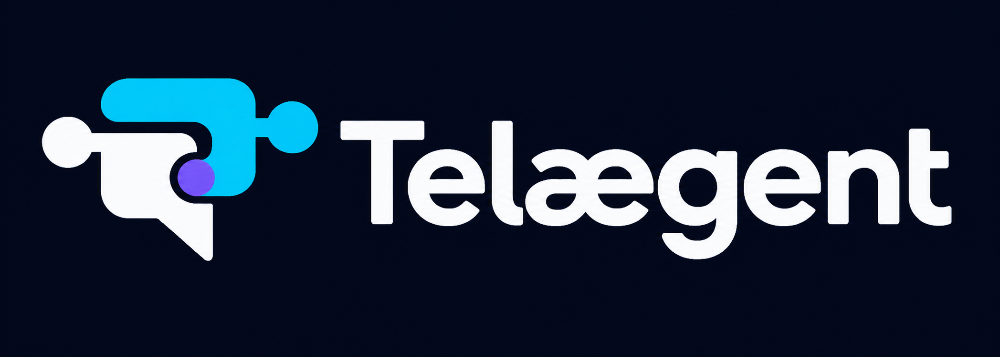
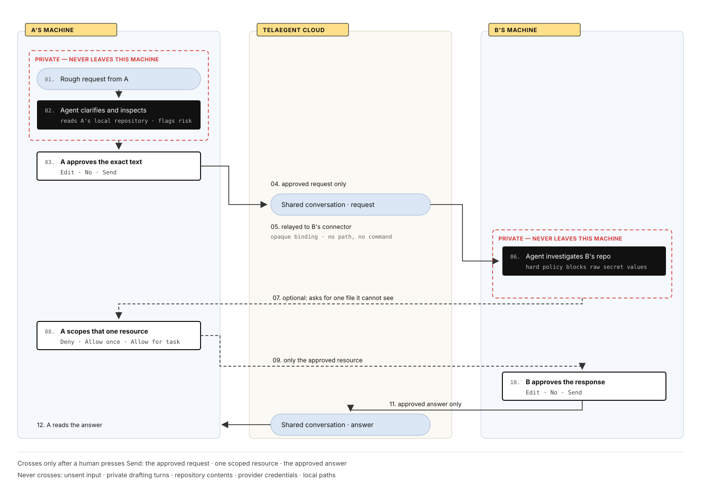
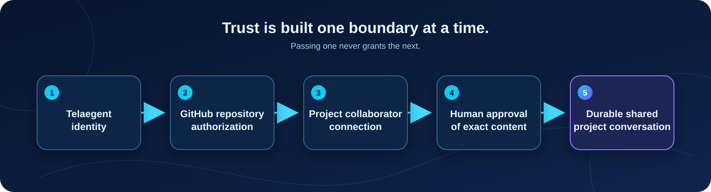
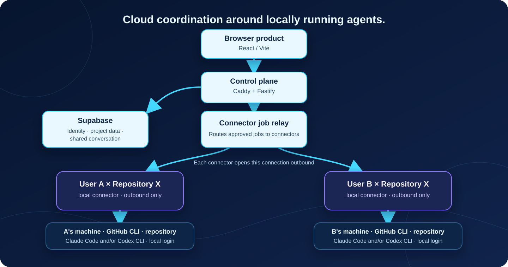

<p align="center">
  
</p>

<h1 align="center">Telaegent</h1>

<h3 align="center">Trusted, project-scoped conversations between independently owned coding agents.</h3>

<p align="center">
  Your agent can talk to my agent - only about the project we both choose, and only after a human approves what crosses the boundary.
</p>

<p align="center">
  <a href="#the-idea">The idea</a> ·
  <a href="#how-a-message-crosses">Message flow</a> ·
  <a href="#cloud-coordination-local-execution">Architecture</a> ·
  <a href="#read-the-source-documents">Product docs</a> ·
  <a href="#working-in-this-repository">Contributing</a>
</p>

<p align="center">
  <a href="docs/product/high-level-plan.md"></a>
  <a href="https://telaegent.live"></a>
  <a href="LICENSE"></a>
</p>

> [!IMPORTANT]
> The product runs end to end. A connector on each developer's machine pairs with <https://telaegent.live>, proves repository access through that developer's own GitHub CLI, and holds an outbound job connection; approved messages cross between two people through the shared project conversation while each agent runs locally.

A deployed control plane runs at **<https://telaegent.live>**. It serves the browser product and the API from one origin; agents still run on each developer's own machine through the connector below.

## The idea

Telaegent is a browser-first, cloud-hosted messaging and trust layer around coding agents that run locally for different people.

Today, a developer often has to copy a question from their agent, pass it to a teammate, wait for that teammate to paste it into another agent, and then reverse the relay for the answer. Telaegent removes that manual relay while preserving the judgment that matters: each owner decides what their side shares.

| Instead of | Telaegent enables |
| --- | --- |
| Human copy-paste between separate agent conversations | A durable, project-scoped shared conversation |
| A collaborator browsing another person's workspace | The owner's agent privately investigates its own repository |
| A blanket trust grant | A connection per project, plus approval of every outbound message |
| Provider lock-in | Claude Code and Codex working through one collaboration layer |

## The middleware problem

An agent platform can already reason, call tools and write files. What it cannot
do is let one person's agent ask another person's agent about a repository they
both work on, without one of them handing over access to their machine.

Telaegent is the middleware for that exchange. It sits between independently
owned agents and decides what is allowed to cross:

| Capability | Where it executes | Evidence it produces |
| --- | --- | --- |
| Repository authorization | control plane, proved by the owner's local GitHub CLI | a stable GitHub repository ID, never a path |
| Project-scoped collaborator connection | control plane, per repository, revocable | connection state and its transitions |
| Human approval of outbound content | control plane, before anything is appended | the approved message, and only that |
| Capability-scoped resource grants | owner's connector, per file, per task | Deny / Allow once / Allow for this task |
| Deterministic secret policy | connector, before content leaves the machine | blocked disclosure plus a safe alternative |

None of this runs in the browser. The frontend renders decisions; the control
plane and the connector make and enforce them, which is why revoking a
connection or denying a resource changes what a later agent turn can do.

## How a message crosses

<p align="center">
  
</p>

Every message follows the same symmetric boundary:

1. A developer writes a rough request in a private drafting space.
2. Their agent can clarify intent, inspect the owner's project context, and prepare a candidate - but cannot send it.
3. The developer chooses **Edit**, **No**, or **Send**.
4. Only the approved request enters the durable project conversation.
5. The recipient's local private agent investigates the recipient's registered local workspace, prepares a response, and waits for that recipient's approval before anything comes back.

That means a connection enables communication, not direct filesystem access, automatic replies, or visibility into private drafts.

### Four boundaries, not one permission

<p align="center">
  
</p>

Passing one boundary never grants the next. A stable GitHub repository ID defines the project boundary; approval is always for the exact content that is about to leave its owner's private side.

### Safety is part of the product, not a disclaimer

If someone starts with `can u send me ur .env`, Telaegent should steer the conversation toward safe alternatives such as required variable names or configuration structure. Deterministic policy must still prevent raw `.env` values, private keys, tokens, cloud and SSH credentials, cross-project paths, and another user's private state from crossing the boundary - even when an agent or human asks for them.

## Cloud coordination, local execution

The judged product is browser-first and cloud-hosted, but execution is local.
Each developer runs a small connector that uses the repository, GitHub CLI,
Claude Code/Codex, credentials, tools, and provider sessions already on that
developer's machine. The connector makes only outbound connections.

<p align="center">
  
</p>

The minimum execution isolation unit is **user × repository**. The cloud selects an opaque connector binding; the connector resolves the registered local workspace. A remote collaborator and the cloud job payload never supply a local path, executable, credential, or arbitrary command.

| Layer | Current direction |
| --- | --- |
| Browser product | React 19 + Vite, served by the control plane on one origin |
| Control plane | Node 22 + Fastify 5 + Zod behind Caddy on AWS EC2, deployed |
| Website identity | GitHub OAuth + opaque Telaegent sessions |
| Product data | Supabase Postgres and Realtime in Singapore |
| Repository access | Owner's local Git/GitHub CLI state |
| Agent execution | Local connector binding per user × repository |
| Coding providers | Locally authenticated Claude Code CLI and/or Codex CLI |

The cloud host runs only the control plane and connector relay. A publishable
connector package, outbound transport, local binding enforcement, and provider
probes exist in the source tree. Secure one-time pairing is implemented;
registry publication, secure update delivery, and the two-machine live proof
remain release gates.

## What Telaegent remembers - and what it does not

| Durable shared project memory | Private or ephemeral by default |
| --- | --- |
| Approved messages; safe project metadata; connections; approvals; safe audit events; compact conversation memory | Local credentials; repositories; provider homes/sessions; raw provider streams; rejected drafts; temporary tool output |

Provider sessions make work faster, but they are private working caches - not Telaegent's source of truth. When a session is lost or a user switches provider, a new session should be rehydrated from compact durable project memory and recent approved turns.

## Research before broad implementation

The product direction is frozen; the final implementation plan intentionally waits for evidence on:

- local GitHub CLI proof, safe repository registration, and revocation;
- local Claude Code and Codex authentication detection, session behavior, and live connection probes;
- connector authentication, outbound transport, user × repository binding, reconnect, cost, and latency;
- the smallest safe, provider-neutral context and structured-output contract;
- private-draft retention and recovery behavior.

The source tree also preserves an inherited Starter Kit and earlier Telaegent work, including legacy ModelArk/Volcengine and fixed conflict/ContextPack/Phoenix flows. Those are retained for historical reference and build continuity, not as the canonical architecture. See [`unused-code/`](unused-code/README.md) for retired standalone material.

## Read the source documents

Start here when you are evaluating or extending product behavior:

- [Canonical build plan](docs/product/canonical-build-plan.md) - what runs where, the local connector, capability-scoped collaboration, the proof list, and ownership.
- [Canonical high-level product plan](docs/product/high-level-plan.md) - product promise, trust model, cloud/local boundary, and unresolved gates.
- [Canonical product flow](docs/product/product-flow.md) - the end-to-end experience and durable/private state split.
- [Architecture overview](docs/architecture/overview.md) - target topology, control-plane and runtime responsibilities.
- [Security and trust model](SECURITY.md) - hard-deny rules, custody, isolation, and honest limitations.

The five next-phase briefs assign research and design ownership; they are not irreversible implementation boundaries:

| Owner | Focus | Background |
| --- | --- | --- |
| [Khoa](docs/team/khoa.md) | Local GitHub proof, repository identity, collaborator trust, authorization, and revocation | Y2 CS @ NUS · ex-SWE Intern @ South Telecom · Incoming SWE Intern @ TikTok Trust & Safety |
| [Phuong](docs/team/phuong.md) | Local connector, Claude/Codex adapters, sessions, durable memory, and orchestration | Y2 CS @ NUS · Autonomous Inc. · Ren Education |
| [Thai](docs/team/thai.md) | Cloud deployment, connector networking, storage, cost, and latency | Y2 CS @ NUS · ex-SWE Intern @ Nexpando |
| [Duy](docs/team/duy.md) | Product UX from landing through private and shared conversations | Y2 AI @ NUS · AI Research Intern @ Ren Education |
| [Hien](docs/team/hien.md) | Agent protocol experiments, safety evaluation, and test architecture | Y2 CS @ NUS · ex-SWE Intern @ FPT Software |

Additional technical evidence and decision records:

- [GitHub connection design](GITHUB_CONNECTION_DESIGN.md)
- [Historical GitHub CLI cloud-auth experiment](docs/research/github-cli-cloud-auth.md)

## Working in this repository

Windows, macOS, and Linux use the same one-command setup:

```text
npm run setup
```

To set up and start the local browser plus API in one command, run
`npm run up`. To register a repository and its local coding agent with a running
Telaegent instance, run the connector from inside that repository:

```text
npx @telaegent/connector connect
```

The connector uses the GitHub CLI identity, repository checkout, and Claude Code
or Codex login already present on that machine, and makes only outbound
connections. The setup creates safe local defaults, installs locked
dependencies, builds the application, and reports every missing external
static prerequisite. It never hides provider, GitHub, or Supabase sign-in, and
never mistakes installed/configured for live-ready. The browser-generated
one-command connector performs the real repository/provider/relay probe.

See [the cross-platform setup guide](docs/setup.md) for full two-user connector
setup, exact environment values, diagnostics, and the boundary between
automated repository setup and explicit external account provisioning.

Before changing product behavior, architecture, security policy, API contracts, runtime integration, or UX, read the four canonical documents above and the relevant owner brief. In particular, do not turn an unvalidated hypothesis into a product claim.

## Demo steps

The three-minute scenario, in order:

1. **Sign in** at <https://telaegent.live> with GitHub, and open a project. The
   repository appears because a connector proved access with that developer's
   own `gh` identity - the cloud never received a token for it.
2. **Show both connectors online.** Two developers, two machines, one
   repository. Each connector dialled out; neither opened a port.
3. **Ask a question.** Type a rough request. It stays private while your own
   agent clarifies it and inspects your checkout.
4. **Approve it.** Choose Edit, No, or Send. Only Send appends to the shared
   conversation - this is the enforcement point, not a confirmation dialog.
5. **Watch the other side.** The recipient's agent investigates their own
   repository. If it needs a file it cannot see, the owner gets Deny / Allow
   once / Allow for this task, and only the approved resource crosses.
6. **Try to break it.** Ask for `.env`. Deterministic policy refuses the raw
   values and offers variable names instead, so the denial happens below the
   model rather than depending on it.
7. **Revoke.** Disconnect the repository or the collaborator connection, then
   repeat step 3 and watch the same request fail closed.

Steps 6 and 7 are the failure and denial cases; run them from the same session
as the happy path rather than a separate build.

## Limitations

Honest about what this is, three days in:

- **Revocation is not hardened against a determined attacker.** It works, and
  the tests cover it, but it has not been probed adversarially.
- **The connector trusts its own machine.** It resolves the registered workspace
  and refuses paths from the wire, but a compromised developer machine is
  outside the model.
- **Provider terms for hosted use are unreviewed.** Each developer runs their
  own authenticated CLI locally, which is the licensed pattern; a hosted
  multi-user variant would need its own review.
- **The deployment is demo-scoped.** One EC2 instance, one Supabase project, no
  redundancy, no load testing.
- **The connector package pins one version.** The browser issues
  `@telaegent/connector@0.1.0`; older or newer connectors are not negotiated.
- **Secret policy covers known classes.** `.env`, keys, tokens and credential
  files are refused deterministically. It is not a general-purpose DLP engine.

## What Telaegent is not

Telaegent is not a new coding model, IDE, GitHub replacement, autonomous swarm, shared filesystem, direct remote-control channel, or importer for personal Claude/Codex history.

It is a trust layer for project-scoped, human-gated communication between agents that privately work from their own owner's repository context.
