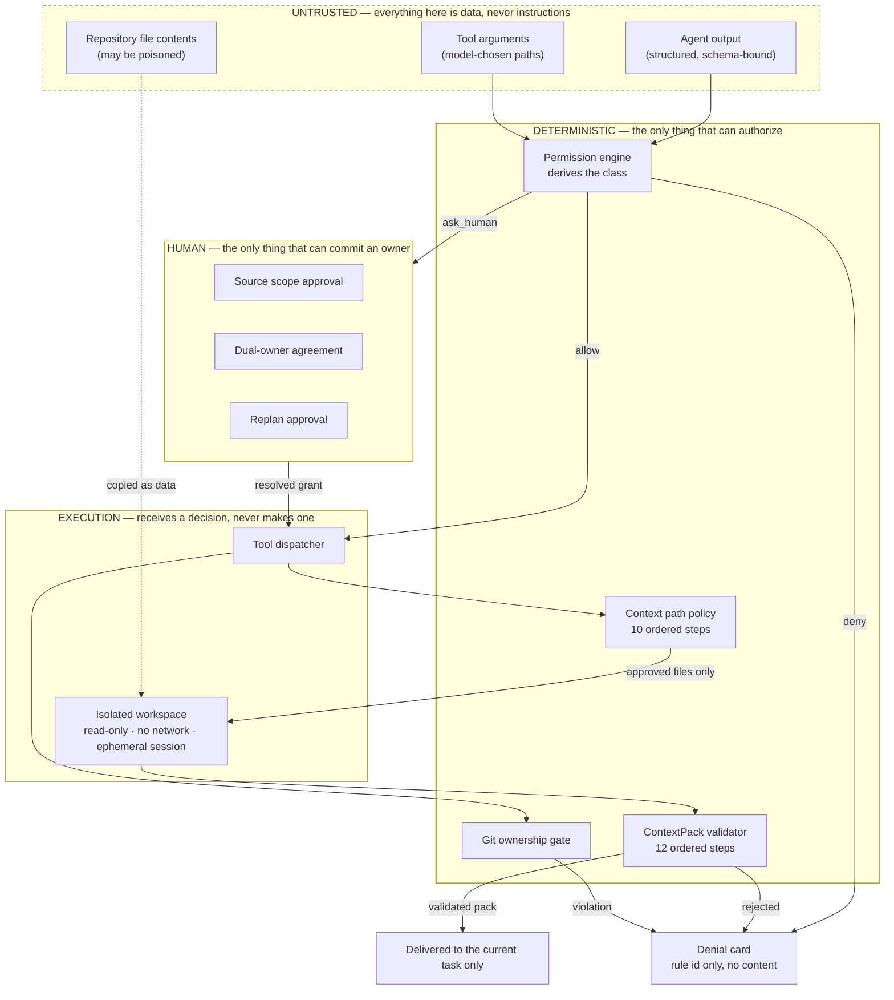

# Telagent — security and privacy

This is the workstream #6 contribution to the submission README. It documents
what Telagent actually protects against, what it does not, and where each claim
is proven in code. Written to be pasted into the final README by the
integration lead.

**The one-sentence version:** the model proposes, deterministic TypeScript
authorizes, and humans approve anything consequential.

---

## Where enforcement sits

Three properties fall out of this shape and are worth stating plainly:

- **The dispatcher never resolves permission.** It receives a decision and
  refuses anything that is not a resolved `allow`. There is no code path from a
  tool call to the approval store, so a tool cannot approve itself.
- **Path denial is a string operation.** `.env` is refused at step 8 of
  normalization, while the path is still text. The filesystem is an injected
  port, so "nothing was opened" is an assertion, not a claim.
- **Source metadata is overwritten, not verified.** The validator does not check
  whether the model's commit hash is right; it replaces every hash and commit
  from a manifest built before the model ran.

---

## What each guarantee is worth, and where it is proven

| Guarantee | Proven by |
| --- | --- |
| `.env` is denied before the file is opened | `context-policy.test.ts` → "the .env proof" — the spy filesystem records zero calls. Repeated in `integration.test.ts` stage 12 against a `.env` that genuinely exists on disk. |
| Traversal, absolute, UNC and mixed-separator paths are refused | `context-policy.test.ts` — 20 spellings, both separator forms, encoded traversal. |
| Symlinks never leave the workspace | `context-policy.test.ts` → "symlink handling" — escaping link, internal link, and a file reached through a symlinked directory. |
| Only approved regular files reach the isolated workspace | `context-workspace.test.ts` — asserts the exact copied set, and that `.env`, `.git` and unapproved siblings are absent. |
| A poisoned source file cannot widen the scope | `context-workspace.test.ts` → "a poisoned source file is copied, but changes nothing". |
| Model-supplied commits and hashes never survive | `context-pack-validator.test.ts` → "trusted metadata wins". |
| Invalid packs are rejected rather than repaired | `context-pack-validator.test.ts` — no sources, unapproved source, stale commit, expired, scope mismatch, oversized, secret-bearing, injection-bearing. |
| No tool can grant or resolve its own permission | `tool-dispatcher.test.ts` → "permission is never resolved inside the dispatcher". |
| A diff crossing an ownership boundary is rejected *before* the commit | `tool-dispatcher.test.ts` and `integration.test.ts` → the working tree is still dirty afterwards. |
| Secrets never reach the store, a snapshot, or an error message | `redaction.test.ts` — asserts the raw literal appears nowhere in the serialized result. |
| Git never pushes, merges, resets or force-anythings | `git-helper.test.ts` — inspects every string literal the module can emit as argv. |

Run `npx tsx apps/server/src/telagent/demo-evidence.ts` to see most of these
produced live, by the same functions the server calls.

---

## What is persisted, and what is not

**Persisted** — validated intents and checkpoints, conflict evidence, proposals
and version-pinned approvals, approved path rules and their expiry, the
ContextPack source manifest and its bounded validated content, dependency
changes and plan revisions, operation state, audit events.

**Never persisted** — hidden reasoning, complete provider transcripts, raw
runtime prompts, raw unvalidated model output, rejected secret-bearing output,
source file bodies outside the final bounded pack, `.env` contents, provider
credentials, provider home directories.

A provider session id lives only on the owning Agent's binding. It is never
shown to the other Agent, never injected into a prompt, and is redacted by key
name before any conversation entry is written.

---

## Encryption, stated honestly

Do not claim more than this in the demo:

- **Browser ↔ server, local demo:** loopback HTTP. Not application-level
  encrypted. It does not leave the demo machine.
- **Server ↔ CLI/container:** child-process stdio and local filesystem or
  container mounts. Not a public message channel.
- **Remote deployment, if attempted:** terminate HTTPS at the ingress. Never
  expose the API over plaintext public HTTP.
- **At rest:** the JSON store is **not encrypted**. The risk is reduced by
  storing only bounded structured coordination data — no credentials, no
  transcripts, no file bodies.
- **Production would need** real identity, scoped tokens, HTTPS or mTLS,
  encrypted storage, key rotation, and audit access control.

No bespoke message encryption was built. Three days is not enough to get
cryptography right, and getting it wrong would add risk without improving the
local demo.

---

## Threat model

**Defended against**

- accidental or malicious `.env` and credential disclosure
- path traversal and symlink escape
- a model inventing or widening its own permission
- prompt injection carried in shared source files
- a model under-reporting its own diff to slip past the ownership gate
- stale or replayed approvals, and duplicate requests
- one Agent reading another's raw transcript or session
- secret-bearing model output or errors reaching the store, the UI, or logs

**Explicitly not defended against** — say so if asked:

- a malicious local administrator
- a compromised provider CLI binary
- production multi-tenant attacks
- cryptographic owner identity (the Alice/Bob switch is a labelled mock)
- secure deletion of provider-owned session files. Telagent detaches the
  ContextPack session and never shares its id, but the provider may keep its own
  session data on the local host and we do not claim otherwise.

---

## Known limits worth disclosing

- The canonical demo's approved scope (`docs/architecture/**`, `src/auth/**`,
  `tests/auth/**`) resolves to **exactly 8 files**, which is the hard maximum.
  Adding one file to the fixture's `src/auth/` or `tests/auth/` would make
  ContextPack generation fail during the demo. A test pins this so the failure
  happens in CI instead.
- The path grammar is deliberately not a glob language: exact files and
  `directory/**` only. Anything else is refused rather than interpreted.
- Redaction is pattern-based. It catches the common credential shapes and is
  backed by a reject-rather-than-redact rule for ContextPacks, but it is not a
  general secret scanner.
