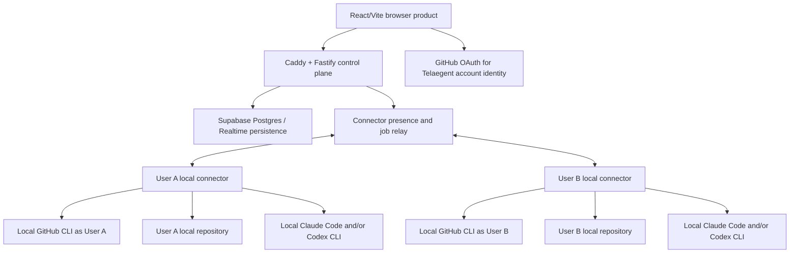
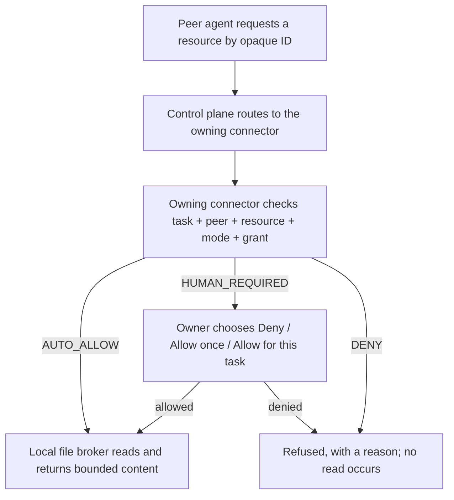

# Telaegent Architecture

## Status

This document describes the target architecture from the [canonical product plan](../product/high-level-plan.md). The local connector, outbound relay, browser device authorization, repository proof, provider probes, human-gated message path, and capability approval/revocation path are implemented and covered by CI. Connector `0.2.3` is published on npm. Production migration verification, protected release automation, and the signed-in two-machine acceptance run remain release gates. The inherited Starter Kit and earlier prototypes remain in the tree as legacy scaffold.

## Product topology



The control plane is deployed on AWS EC2 behind Caddy, which terminates HTTPS and serves the browser product and the API from one origin at telaegent.live. Supabase is in Southeast Asia/Singapore. The control plane is not an agent execution platform; it hosts coordination and relay services only, and holds no repository content, provider credential or local path.

## Isolation boundary

The minimum trust unit is user x repository.

Each local connector binding requires:

- one connector binding owned by one user and stable repository ID
- a connector-selected registered local workspace, never a cloud- or collaborator-provided path
- no cross-project path resolution
- the owning developer's local GitHub/provider credentials only
- bounded CPU, memory, time, output, and cancellation
- log redaction and safe cleanup/revocation

A new process is not automatically a new identity. The local connector must bind GitHub, Claude, and Codex home/config/session state to the owning developer and project without uploading that state.

The concrete infrastructure handoff and acceptance checks are defined in
[Local connector execution requirements](./runtime-isolation-requirements.md).
Normalized provider states and recovery behavior are defined in
[Provider failure and reconnect behavior](./provider-failure-reconnect.md).

## Control-plane responsibilities

- Telaegent identity and sessions
- stable GitHub repository identity and proven access
- project memberships and collaborator connection state
- shared conversations and approved messages
- private-draft metadata/status without cross-user visibility
- exact outbound approval and idempotent send
- connector/provider status and opaque connector binding IDs
- task and resource-request routing between connectors
- safe capability/grant metadata, never the local paths behind it
- safe audit and correlation IDs
- compact conversation memory for provider rehydration

## Local connector responsibilities

- machine authorization through a short-lived browser approval, with its
  bearer stored in the operating-system credential vault
- local GitHub CLI access verification and safe repository metadata registration
- Claude Code/Codex installation and provider connection probe
- fresh or resumed local Telaegent-created provider sessions
- sender draft and recipient answer turns
- bounded repository inspection
- structured candidate output
- timeout, cancel, reconnect, and session-loss behavior
- the local resource registry mapping opaque resource IDs to canonical paths
- deterministic scope checks and local consent enforcement
- a local file broker performing every authorized read

## Conversation state

```text
private draft: created -> agent working -> clarification/ready/blocked
ready -> human edit/send/cancel
send -> atomic approved shared message
incoming shared message -> recipient private agent -> recipient approval -> shared response
```

Only approved content belongs to the shared conversation. Provider sessions are caches; Supabase-backed Telaegent conversation state is durable memory.

The browser animates only newly completed private-agent output and genuinely
new peer messages. Existing or recovered history renders immediately, incoming
message reveals are serialized, and `prefers-reduced-motion` disables the
typewriter presentation. Animation is presentation only; it never changes
message ordering, persistence, approval, or delivery state.

## Capability-scoped resource requests

Specified in [canonical build plan section 8](../product/canonical-build-plan.md).
Task/grant contracts, cloud route checks, resource delivery, local grant
enforcement, the scope-expansion queue, the bounded autonomous rounds and the
owner-facing approval screen are implemented: a scope request is answered in
the browser, with Deny, Allow once and Allow for this task.

Owners can inspect active grants and revoke one individually. Revocation is
propagated to the relay and connector-local reference monitor; a queued or
stale cloud assertion for that grant is stripped or denied before a file read.

A recipient's agent often needs a file it does not own. The request path keeps
the cloud out of the decision:



The control plane routes; it never authorizes. The owning connector is the
reference monitor for its owner's files, and re-checks authorization
immediately before each read.

Automatic access requires all of: same task, same peer, same exact resource,
read-only, an unexpired human grant, and safe resolution inside the registered
project. A mixed request splits — already-approved resources resolve
immediately while new ones wait for their owner, so the requesting agent is not
blocked on the whole batch.

A remote peer holds only opaque resource IDs and safe metadata. For a file it
has never been granted, it may send a bounded project-relative hint such as
`src/settings.ts` with a reason; that always requires human approval before the
path is registered or read.

## GitHub access

P0 does not require a GitHub App. The connector uses the developer's existing local GitHub CLI authentication, local remote, branch, and commit. If authentication is missing, the user runs `gh auth login` locally; the cloud neither initiates nor stores that login.

Collaborator discovery uses mutual proof: both Telaegent users independently connected the same stable GitHub repository ID. It does not depend on one user having permission to enumerate every repository collaborator.

## Remaining release and product gates

- production deployment and verification of the latest device-authorization
  migration
- protected npm release automation, provenance policy, and connector update
  policy
- signed-in two-machine packaged validation across Claude-only, Codex-only,
  dual-provider, reconnect, revocation, and partial-provider-failure paths
- private-draft retention policy
- resource-ID behavior when a file is renamed or deleted during a task
- safe branch/worktree metadata policy beyond the current periodic proof refresh
- durable relay/redelivery across a control-plane restart
- measured live latency, cost, and adversarial isolation/revocation evidence

These are not permission to replace the implemented architecture with cloud
provider execution, LAN workers, or LLM-decided authorization.
