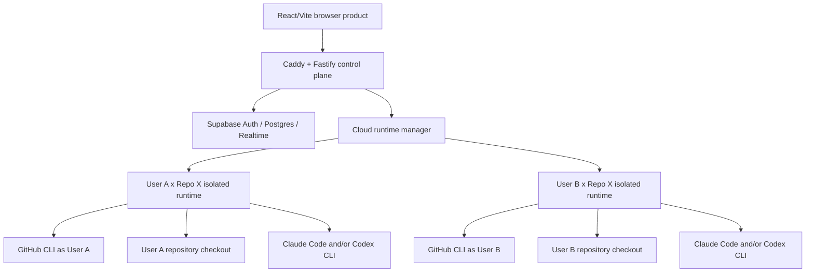

# Telaegent Architecture

## Status

This document describes the target architecture from the [canonical product plan](../product/high-level-plan.md). It is not a claim that the cloud runtime has already been implemented. The inherited Starter Kit and earlier prototypes remain in the tree as legacy scaffold.

## Product topology



Frontend hosting is provisionally Vercel. The control plane is provisionally Azure behind Caddy/HTTPS. Supabase is provisionally in Southeast Asia/Singapore. The exact Azure execution primitive remains a research decision.

## Isolation boundary

The minimum trust unit is user x repository.

Each unit requires:

- separate repository workspace
- separate process/container boundary
- no cross-user or sibling-repository mounts
- backend-selected workspace binding, never a collaborator-provided path
- owning user's GitHub/provider credentials only
- bounded CPU, memory, time, output, and cancellation
- log redaction and safe cleanup/revocation

A new process is not automatically a new identity. GitHub, Claude, and Codex home/config/session state must be explicitly isolated and persisted only where required.

## Control-plane responsibilities

- Telaegent identity and sessions
- stable GitHub repository identity and proven access
- project memberships and collaborator connection state
- shared conversations and approved messages
- private-draft metadata/status without cross-user visibility
- exact outbound approval and idempotent send
- provider/runtime status
- safe audit and correlation IDs
- compact conversation memory for provider rehydration

## Runtime responsibilities

- GitHub CLI authorization and clone/fetch inside owning environment
- Claude Code/Codex installation and provider connection probe
- fresh or resumed Telaegent-created provider sessions
- sender draft and recipient answer turns
- bounded repository inspection
- structured candidate output
- timeout, cancel, reconnect, and session-loss behavior

## Conversation state

```text
private draft: created -> agent working -> clarification/ready/blocked
ready -> human edit/send/cancel
send -> atomic approved shared message
incoming shared message -> recipient private agent -> recipient approval -> shared response
```

Only approved content belongs to the shared conversation. Provider sessions are caches; Supabase-backed Telaegent conversation state is durable memory.

## GitHub access

P0 does not require a GitHub App. The preferred hypothesis is GitHub CLI web/device authorization inside the user's cloud environment, followed by authenticated-user repository API discovery and `gh repo clone`.

Collaborator discovery uses mutual proof: both Telaegent users independently connected the same stable GitHub repository ID. It does not depend on one user having permission to enumerate every repository collaborator.

## Fallback architecture

A local connector may reuse local repositories and CLI auth if cloud authentication/isolation proves infeasible. It is documented only as fallback and is not part of the browser-first judged promise.

## Unresolved gates

- exact headless GitHub CLI authorization UX and credential storage
- supported hosted authentication for Claude Code/Codex
- Azure VM versus Container Apps/Jobs versus dedicated runtime VM
- per-user credential layer versus per-user x repository provider home
- private-draft retention
- repository refresh/branch policy
- polling versus SSE versus Supabase Realtime
- measured latency and cost

Do not freeze these through code before the owner briefs' experiments are complete.
